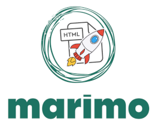

### codesend

> JS snippet to send codeblock contents as a query string

🚧 **Under construction!**

## Usage 


Wrap elements in custom HTML elements to render them as marimo notebooks.

### Open in an new tab

````md
This is a demo site.

```python
a = 1
b = 2
```

This adds a button that links to a marimo playground notebook preloaded
with Python code.

<div>
<marimo-button>
```python
def hello_world():
    print("Hello, World!")
```
</marimo-button>
</div>
````

> [!NOTE]  
> You might wonder why we wrap the `<marimo-button>` element with an extra `<div>`. This is related to how different markdown preprocessors might handle the custom HTML elements. To guarantee that this approach works across all markdown tools out there we need to wrap the custom elements in a block element. That's simply the least brittle approach.


### Embed in an inline interactive notebook

````md
This replaces the python code with an inline marimo notebook.
<div>
<marimo-iframe>
```python
def hello_world():
    print("Hello, World!")
```
</marimo-iframe>
</div>

Multiple code blocks will be replaced with an entire notebook.

<div>
<marimo-iframe>
```python
import marimo as mo
```
```python
slider = mo.ui.slider(1, 10)
slider
```

```python
slider.value * "🍃"
```
</marimo-iframe>
</div>

<script src="extractor.js"></script>
````

### Try locally

To run this locally, you only need mkdocs. 

```bash
uv run --with mkdocs-material mkdocs serve
```
